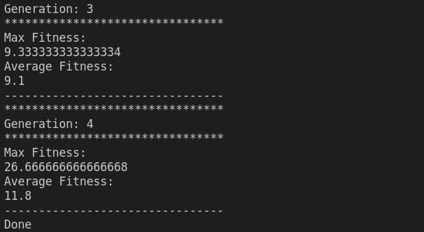
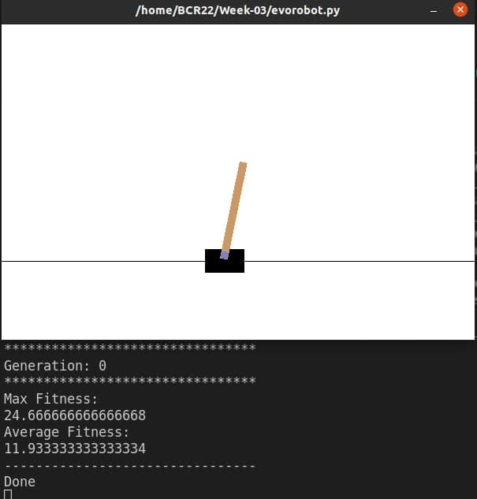
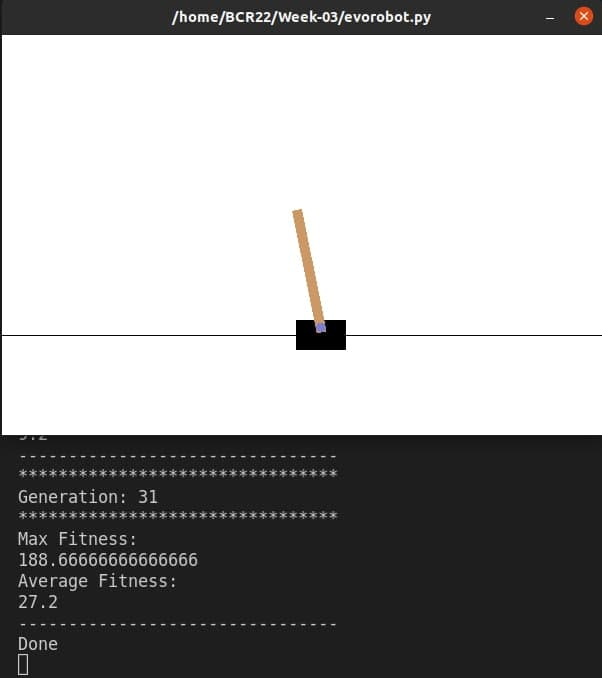
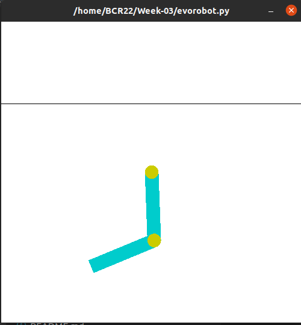
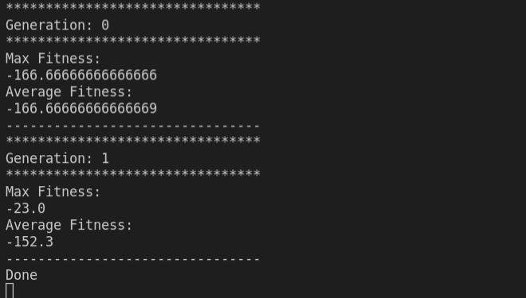

## Cartpole-v0

- Default settings with threshold 11 and populations initialized to zero:

- threshold 20, rand populations * 0.1

- threshold 40, rand populations * 0.1

## Acrobot-v1
threshold = -50

